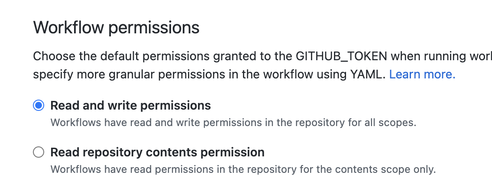

# Static Website for Koala Time
Built with jekyll, deployed with github pages.

## Installation
Stub for later work

## Packages
* Jekyll menu: https://github.com/forestryio/jekyll-menus

## Theme
Using this theme: https://github.com/murraco/jekyll-theme-minimal-resume.
But am thinking about packaging into my own.

## Components:
To create callouts, use the following syntax:
```html
<div class="info-msg">
  <i class="fa fa-info-circle"></i>
  This is an info message.
</div>

<div class="success-msg">
  <i class="fa fa-check"></i>
  This is a success message.
</div>

<div class="warning-msg">
  <i class="fa fa-warning"></i>
  The project is currently archived, with limited ongoing development.
</div>

<div class="error-msg">
  <i class="fa fa-times-circle"></i>
  This is a error message.
</div>
```

## Running Locally
Do this command:
```bash
bundle exec jekyll serve
```

---

## NOTES:
1. Since this site uses non-whitelisted packages and themes
you must deploy using this CI workflow: https://github.com/jeffreytse/jekyll-deploy-action.

  Deployment script located here: [`.github/worfklows/build-jekyll.yml`](.github/workflows/build-jekyll.yml)


2. When deploying, you must grant Github Actions `Read and write permissions`.
This can be found under `settings` > `actions` > `general` > `workflow permissions`.
See the screenshot for reference:

  


<br>
